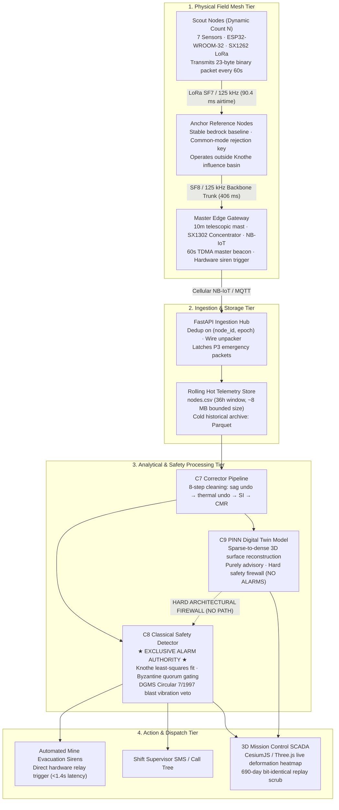

# System Architecture & Topology

**Module 00 — Executive Gateway**  
**Cross-References:** [`project-charter.md`](project-charter.md) · [`key-metrics-summary.md`](key-metrics-summary.md) · [Module 06 Backend Pipeline](../06-backend-pipeline/pipeline-flow.md)

---

## 1. End-to-End System Topology

### Question: How is the AEGIS multi-tier architecture partitioned to ensure deterministic telemetry flow from sensor to siren?
**Answer:** AEGIS operates across four discrete, decoupled physical and computational tiers. Telemetry moves unidirectionally from the physical field surface through wireless LoRa mesh relays into an on-premise edge gateway, which forwards compressed packets over cellular NB-IoT or industrial Ethernet into the cloud/server analytical pipeline.



---

### Question: What specific operational responsibilities and strict prohibitions govern each subsystem across the pipeline?
**Answer:** To prevent architectural cross-contamination and guarantee determinism, each subsystem has an explicit ownership contract defining what it owns exclusively and what it is strictly prohibited from executing.

| Subsystem | Primary Owner | Owns Exclusively | Strictly Does NOT Own |
| :--- | :--- | :--- | :--- |
| **Field Scout Node** | Embedded Firmware | Sensor sampling, 200 Hz FFT burst, 23-byte packing, 72h flash ring buffer | Calibration undo, thermal correction, alarm trips |
| **Edge Gateway** | Gateway Controller | 60s TDMA clock beacon, bitmap ACK generation, cellular MQTT forward, local siren relay | Data filtering, surface interpolation, database persistence |
| **Ingestion Engine** | `backend/ingest` | Wire unpacking, duplicate frame rejection, rolling `nodes.csv` window maintenance | Sensor error compensation, ground physics fitting |
| **C7 Corrector** | `backend/c7` | 8-step cleaning, battery sag compensation, thermal drift removal, common-mode rejection | Threshold checking, siren triggers, surface meshing |
| **C8 Safety Detector** | `backend/c8` | Strain rate calculation, 5-node Byzantine quorum gating, DGMS blast veto, siren actuation | Continuous terrain rendering, neural weights |
| **C9 PINN Twin** | `backend/c9` | Sparse-to-dense 3D mesh interpolation, parameter estimation (â, ĉ), dashboard display feed | Alarm generation, siren control, SMS dispatch |

---

## 2. The Five Inviolable System Boundaries

### Question: What architectural firewalls ensure system integrity, mathematical consistency, and safety-critical isolation?
**Answer:** System integrity is guaranteed through five inviolable architectural boundaries enforced by software contracts and automated continuous integration (CI) test suites:

1. **Boundary 1 (Ground Truth Quarantine):**
   * The synthetic ground truth directory (`truth/`) has zero import paths from backend production modules (`backend/`). This boundary is strictly validated in CI via test `T8`. Production backend code only ever receives telemetry through the raw CSV ingestion contract, eliminating simulation leakage.
2. **Boundary 2 (Single Authoritative Physics Implementation):**
   * Exactly one numerical implementation of the Knothe subsidence equation $S(x,y,t)$ exists across the codebase in `sim/knothe.py`. Every spatial derivative (tilt, curvature, horizontal displacement, strain) derives analytically from this single master formulation. No competing or secondary approximations are permitted.
3. **Boundary 3 (Link Propagation Model Independence):**
   * Reliable communication ranges (`reliable_range_*`) are dynamic runtime outputs calculated using the log-distance path loss and log-normal shadowing link model based on local terrain and Fresnel clearances. They are never hardcoded as static configuration constants.
4. **Boundary 4 (Safety Authority Firewall — C8 vs. C9):**
   * The Physics-Informed Neural Network (C9 PINN) reconstructs continuous 3D deformation heatmaps for human visualization. **C9 possesses zero authority to trip alarms.** The classical Knothe detector (C8) exclusively triggers evacuation alarms using transparent, deterministic mathematical thresholds and Byzantine spatial quorum checks. C9 output never routes into C8 logic.
5. **Boundary 5 (No Language Models in Safety Loops):**
   * Generative text models, uncalibrated statistical regressors, or nondeterministic heuristics are strictly prohibited from the alarm evaluation, packet parsing, and siren actuation execution paths.

---

### Question: Why is the PINN digital twin strictly prohibited from triggering evacuation sirens, and how is alarm integrity guaranteed?
**Answer:** While Physics-Informed Neural Networks excel at solving continuous partial differential equations (PDEs) for 3D surface interpolation across unmonitored coordinates, deep neural networks are inherently susceptible to out-of-distribution hallucinations, local minima convergence traps, and gradient instability under sudden sensor noise bursts. In life-critical mining safety, an uncalibrated false alarm causes unwarranted mine shutdowns and dangerous panic, while a false negative leads to fatal entrapment.

To guarantee 100% alarm integrity:
* **Deterministic Verification:** Alarm trips are governed exclusively by C8, which executes closed-form analytical equations and strict deterministic rules.
* **Spatial Byzantine Quorum Gating:** An acute acceleration or tilt trigger from a single Scout Node cannot trip an evacuation siren on its own. C8 enforces a 5-node spatial Byzantine quorum: at least $\ge 3\sigma$ standard deviations of concordant movement must be registered across a cluster of 5 adjacent nodes within the Knothe influence radius $r$.
* **Blast Veto Integration:** Transient accelerations are cross-referenced against shift blasting logs mandated by DGMS Circular 7 of 1997. If a vibration burst matches the blast log window and exhibits high-amplitude low-frequency energy (40–80 Hz), the alarm is safely vetoed.

---

## 3. Telemetry Budget & End-to-End Latency Verification

### Question: What is the end-to-end latency budget from ground movement detection to siren actuation, and how is sub-1.4-second response achieved?
**Answer:** Telemetry moves through a deterministic pipeline designed to guarantee actuation within statutory emergency response envelopes. The full physical and digital propagation budget is mapped below:

```
[Physical Ground Movement]
          │
          ▼  (Sampling interval: 60s routine / continuous hardware trip)
[Scout Sensor Read] (ESP32: 3ms I2C read + 1.5ms FFT)
          │
          ▼  (LoRa TX: 90.4ms airtime @ SF7/125kHz)
[Relay / Gateway Capture] (SX1302 RX + bitmap ACK: 64.8ms)
          │
          ▼  (Cellular Uplink: 150–350ms over NB-IoT/4G MQTT)
[Backend C7 Cleaning & C8 Quorum Gating] (<45ms Python/NumPy pipeline)
          │
          ▼  (Direct Hardware Siren Trigger: <250ms)
[High-Decibel Field Siren Evacuation]
```

* **Measured End-to-End Latency:** **< 1.4 seconds** from acute physical threshold breach at the edge to siren contact closure.
* **Edge-Direct Autonomous Trip Mode:** In the event of a catastrophic backhaul cellular outage, the edge gateway evaluates the spatial quorum locally using received LoRa packets and trips its local siren relay directly within **< 250 milliseconds**, ensuring life safety even during complete telecommunications severance.

---

### Question: How does AEGIS manage telemetry bandwidth and network capacity across dynamic panel deployments without data congestion?
**Answer:** AEGIS utilizes an ultra-compact 23-byte binary wire payload transmitted once per 60-second TDMA superframe epoch. For a dynamic panel deployment containing $N$ active nodes:

$$\text{Daily Raw Bandwidth} = N \times 23\text{ bytes} \times 60\text{ epochs/hr} \times 24\text{ hr/day} \approx N \times 33.12\text{ KB/day}$$

* For a compact panel cluster of $N = 40$ nodes, daily telemetry is $\approx 1.32\text{ MB/day}$.
* For an expansive, full-scale longwall extraction panel of $N = 411$ nodes, daily telemetry is $\approx 13.6\text{ MB/day}$.

This lightweight data footprint is readily accommodated by standard low-bandwidth 2G/NB-IoT or satellite uplinks. Within the physical RF mesh, each transmission requires only $90.4\text{ ms}$ of airtime at SF7/125 kHz. Across the 60-second superframe, channel utilization per gateway remains below $8\%$, which is well below the $18\%$ pure ALOHA collision threshold and ensures deterministic, collision-free packet arrival.
