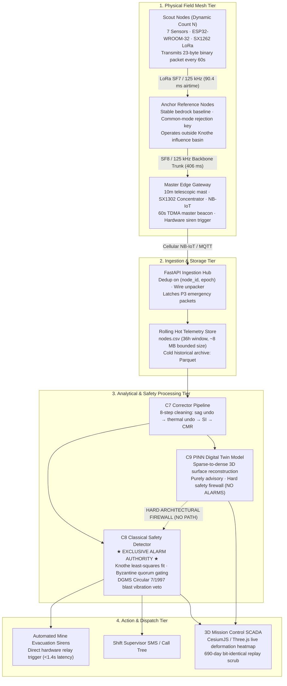

# System Architecture & Topology

**Module 00 — Executive Gateway**  
**Cross-References:** [`project-charter.md`](project-charter.md) · [`key-metrics-summary.md`](key-metrics-summary.md) · [Module 06 Backend Pipeline](../06-backend-pipeline/pipeline-flow.md)

---

## 1. End-to-End System Topology

AEGIS operates across four discrete physical and computational tiers. Telemetry moves unidirectionally from the field surface through LoRa mesh relays into an on-premise gateway, which forwards packets over cellular NB-IoT/Ethernet into the ingestion engine. 



---

## 2. The Five Inviolable System Boundaries

System integrity is preserved through five architectural firewalls enforced by software contracts and CI test suites:

1. **Boundary 1 (Ground Truth Quarantine):**
   The synthetic ground truth directory (`truth/`) has zero import paths from backend production modules (`backend/`). This boundary is tested automatically in CI via test `T8`. Backend code only ever sees telemetry through the raw CSV ingestion contract.
2. **Boundary 2 (Single Authoritative Physics Implementation):**
   Exactly one numerical implementation of the Knothe subsidence equation $S(x,y,t)$ exists in `sim/knothe.py`. Every spatial derivative (tilt, curvature, horizontal displacement, strain) derives analytically from this single function. No secondary approximations exist.
3. **Boundary 3 (Link Propagation Model Independence):**
   Reliable communication ranges (`reliable_range_*`) are runtime outputs calculated by the log-distance path loss and log-normal shadowing link model. They are never declared as static configuration constants.
4. **Boundary 4 (Safety Authority Firewall — C8 vs. C9):**
   The Physics-Informed Neural Network (C9 PINN) reconstructs 3D continuous deformation heatmaps for human operators. **C9 possesses zero authority to trip alarms.** The classical Knothe detector (C8) exclusively makes evacuation decisions using transparent, deterministic mathematical thresholds and Byzantine spatial quorum checks. C9 output never routes into C8 logic.
5. **Boundary 5 (No Language Models in Safety Loops):**
   No generative text model or uncalibrated statistical black box is permitted in the alarm evaluation, packet parsing, or siren triggering paths.

---

## 3. Subsystem Ownership Matrix

| Subsystem | Primary Owner | Owns Exclusively | Strictly Does NOT Own |
| :--- | :--- | :--- | :--- |
| **Field Scout Node** | Embedded Firmware | Sensor sampling, 200 Hz FFT burst, 23-byte packing, 72h flash ring buffer | Calibration undo, thermal correction, alarm trips |
| **Edge Gateway** | Gateway Controller | 60s TDMA clock beacon, bitmap ACK generation, cellular MQTT forward, local siren relay | Data filtering, surface interpolation, database persistence |
| **Ingestion Engine** | `backend/ingest` | Wire unpacking, duplicate frame rejection, rolling `nodes.csv` window maintenance | Sensor error compensation, ground physics fitting |
| **C7 Corrector** | `backend/c7` | 8-step cleaning, battery sag compensation, thermal drift removal, common-mode rejection | Threshold checking, siren triggers, surface meshing |
| **C8 Safety Detector** | `backend/c8` | Strain rate calculation, 5-node Byzantine quorum gating, DGMS blast veto, siren actuation | Continuous terrain rendering, neural weights |
| **C9 PINN Twin** | `backend/c9` | Sparse-to-dense 3D mesh interpolation, parameter estimation ($\hat{a}, \hat{c}$), dashboard display feed | Alarm generation, siren control, SMS dispatch |

---

## 4. End-to-End Latency & Telemetry Budget

Data flows through the pipeline with verified maximum latency ceilings:

```
[Physical Ground Movement]
          │
          ▼  (Sampling interval: 60s routine / continuous hardware trip)
[Scout Sensor Read] (ESP32: 3ms I2C read + 1.5ms FFT)
          │
          ▼  (LoRa TX: 90.4ms airtime @ SF7/125kHz)
[Relay / Gateway Capture] (SX1302 RX + bitmap ACK: 64.8ms)
          │
          ▼  (Cellular Uplink: 150–350ms over NB-IoT/4G MQTT)
[Backend C7 Cleaning & C8 Quorum Gating] (<45ms Python/NumPy pipeline)
          │
          ▼  (Direct Hardware Siren Trigger: <250ms)
[High-Decibel Field Siren Evacuation]
```

* **Total Measured Critical Latency:** **< 1.4 seconds** from acute threshold breach at the edge to siren contact closure.
* **Routine Telemetry Bandwidth:** 23 bytes per node per 60-second epoch. For a representative panel deployment of 37 nodes, daily raw bandwidth is $\approx 1.22\text{ MB/day}$, easily accommodated by low-cost 2G/NB-IoT telemetry plans.
