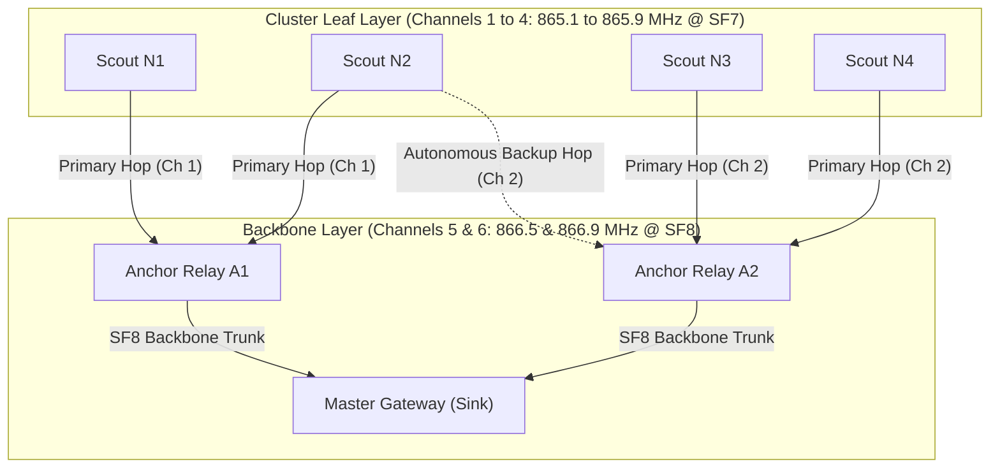

# Multi-Frequency DAG Routing & Autonomous Failover

**Module 03 — Mesh Networking**  
**Cross-References:** [`tdma-scheduling.md`](tdma-scheduling.md) · [`store-and-forward.md`](store-and-forward.md) · [Module 08 Verification](../08-verification/test-register.md)

---

## 1. Multi-Frequency Directed Acyclic Graph (DAG) Topology

AEGIS routes field telemetry through a multi-frequency Directed Acyclic Graph (DAG) designed to avoid co-channel interference between dense cluster uplinks and long-range backbone relays.



### Channel Plan

| Channel Group | Frequencies | Spreading Factor | Maximum Transmit Power | Function |
| :--- | :--- | :--- | :--- | :--- |
| **Channels 1 – 4** | 865.1, 865.5, 865.9, 866.1 MHz | SF7 / BW125 | 14 dBm (25 mW) | Scout leaf-to-anchor cluster uplinks |
| **Channels 5 – 6** | 866.5, 866.9 MHz | SF8 / BW125 | 27 dBm (500 mW) | Anchor-to-Gateway backbone relays |
| **Beacon Channel** | 865.1 MHz | SF7 / BW125 | 30 dBm (1 W) | Gateway 60-second synchronization beacon |

---

## 2. Parent-Child Relationship & Dual-Parent Provisioning

Every Scout node is pre-configured with two distinct upstream routing destinations derived during site commissioning:
1. **Primary Parent ($P_1$):** The nearest Anchor Relay providing $\ge 15\text{ dB}$ link margin under 90th percentile log-normal shadowing (Test T21).
2. **Backup Parent ($P_2$):** An adjacent Anchor Relay situated in an independent geographical sector providing $\ge 10\text{ dB}$ link margin.
3. **Hop Limit:** Paths are strictly bounded to **2 hops nominal** (Scout $\to$ Anchor $\to$ Gateway) and **3 hops in severe failover** (Scout $\to$ Peer Relay $\to$ Anchor $\to$ Gateway), ensuring delivery latencies never exceed the superframe boundaries.

---

## 3. Autonomous Failover Protocol (`relay_kill` Recovery)

Subsidence tension cracks or heavy earth-moving equipment can physically destroy an Anchor Relay during mining operations. The network recovers autonomously without human intervention:

```
[Normal Operation]
Scout transmits in primary slot → Receives Bitmap ACK from Primary Anchor (P1) → Sleep

[Relay Destruction Event (t = 0)]
Scout transmits in primary slot → Primary Anchor destroyed → No Bitmap ACK received (Timeout: 150 ms)
      │
      ▼
[Autonomous Retransmit & Failover]
Scout flips bit 5 ('failover_active') in status_flags
Switches radio channel to Backup Parent (P2) frequency
Transmits packet during the Backup Slot Window (46.0s – 50.0s)
      │
      ▼
[Recovery Complete]
Backup Anchor (P2) captures packet, appends to its next trunk bundle
Master Gateway receives telemetry at t < 50s. ZERO ROWS LOST (Verified by Test T11).
```

---

## 4. Discriminating Relay Loss (F4) vs. True Ground Collapse (F3)

When multiple sensor signals abruptly disappear from the telemetry stream, the safety engine must immediately distinguish between a routine electronics/relay failure and a catastrophic ground collapse that severed sensor cables:

| Diagnostic Dimension | Class F4: Relay Hardware Failure | Class F3: Catastrophic Ground Collapse |
| :--- | :--- | :--- |
| **Spatial Signature** | All children of a single relay vanish simultaneously. | Concentrated along high-strain shear inflection zones. |
| **Precursor Strain** | Precursor strain trend is flat ($\Delta\varepsilon \approx 0$). | Precursor strain accelerated sharply over previous 3–5 epochs. |
| **Backup Slot Telemetry**| Children reappear via backup parents in slots 46–50s. | Nodes remain permanently dead across all frequencies. |
| **Crack Sensor Flags** | `crack_level` remains 00 (intact). | `crack_level` latches to 11 (severed trace). |
| **Engine Action** | Raises yellow maintenance alert `F4_RELAY_OFFLINE`. | **Trips Red Emergency Evacuation Siren `CLASS_A_COLLAPSE`.** |

This discrimination logic (verified by test `T22`) prevents false full-mine evacuations caused by simple relay battery dropouts or antenna damage.
