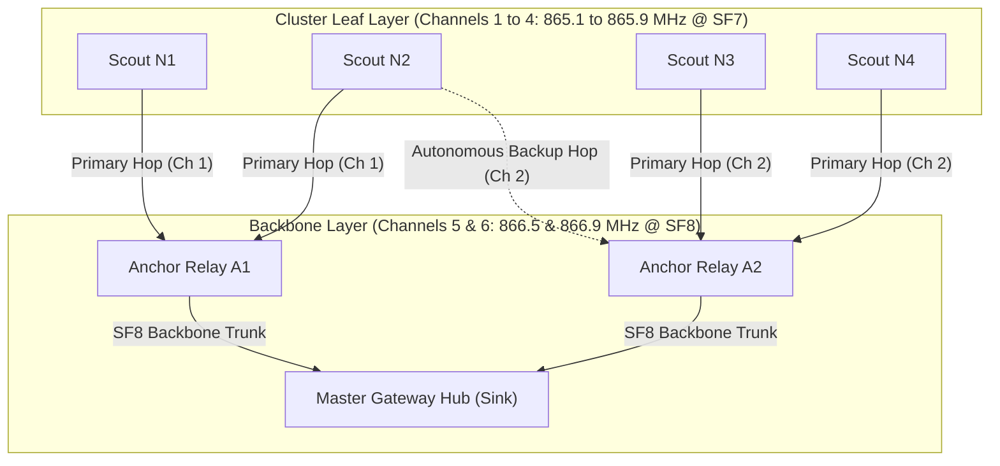

# Multi-Frequency DAG Routing & Autonomous Failover

**Module 03 — Mesh Networking**  
**Cross-References:** [`tdma-scheduling.md`](tdma-scheduling.md) · [`store-and-forward.md`](store-and-forward.md) · [`wire-format.md`](wire-format.md) · [Module 08 Verification](../08-verification/test-register.md) · [Module 06 C8 Alarm Engine](../06-backend-pipeline/c8-alarm-engine.md)

---

## 1. Multi-Frequency Directed Acyclic Graph (DAG) Architecture

### Question: How does AEGIS structure its wireless mesh routing topology, and why is a multi-frequency Directed Acyclic Graph (DAG) chosen over flat single-frequency mesh protocols?

**Answer:** Flat single-frequency mesh architectures (such as standard Zigbee mesh or single-channel LoRa repeaters) experience severe co-channel self-interference and packet collisions when relays attempt to retransmit packets on the exact same carrier frequency as child nodes. In dense sensor arrays, this results in the classic "hidden terminal" problem and channel collapse.

AEGIS eliminates co-channel interference by decoupling the physical layer into a two-tier **Multi-Frequency Directed Acyclic Graph (DAG)**:
1. **Cluster Leaf Layer (Channels 1–4):** Scout nodes communicate with their designated Anchor Relays over short-range, low-power links at Spreading Factor 7 (SF7).
2. **Backbone Relay Layer (Channels 5–6):** Elevated Anchor Relays bundle child telemetry and transmit upstream to the Master Gateway over dedicated, long-range backbone channels at Spreading Factor 8 (SF8) with higher transmit power.
3. **Loop-Free DAG Topology:** Routing paths flow strictly in one direction towards the gateway sink, mathematically preventing routing loops and unbounded hop delays.



### Question: What are the frequency assignments, spreading factors, transmit powers, and regulatory bounds for each channel in the routing plan?

**Answer:** The channel plan divides the license-free 865–867 MHz band into distinct operational sub-bands compliant with Indian GSR 564(E) regulations:

| Channel Group | Center Frequencies | Modulation & Bandwidth | RF Transmit Power | Operational Role |
| :--- | :--- | :--- | :--- | :--- |
| **Channels 1 – 4 (Cluster Leaf)** | 865.1, 865.5, 865.9, 866.1 MHz | LoRa SF7 / BW 125 kHz | $+14\text{ dBm}$ ($25\text{ mW}$) | Scout-to-Anchor short-range cluster uplinks ($<150\text{m}$). Low power conserves battery and minimizes cross-cluster RF spillover. |
| **Channels 5 – 6 (Backbone Trunk)** | 866.5, 866.9 MHz | LoRa SF8 / BW 125 kHz | $+27\text{ dBm}$ ($500\text{ mW}$) | Anchor-to-Gateway long-range backbone relays ($500\text{m to }3,000\text{m}$). Higher link margin overcomes NLOS terrain obstructions. |
| **Beacon Channel** | 865.1 MHz | LoRa SF7 / BW 125 kHz | $+30\text{ dBm}$ ($1.0\text{ W}$) | Broadcast by the elevated Master Gateway at the beginning of each 60-second superframe to achieve panel-wide TDMA clock synchronization. |

---

## 2. Parent-Child Provisioning and Hop Bounding

### Question: How are parent-child routing relationships established, and how does dual-parent provisioning prevent single points of failure without creating routing loops?

**Answer:** Routing paths are deterministically provisioned during commissioning and optimized based on RF link quality:

1. **Primary Parent ($P_1$):**
   The primary Anchor Relay assigned to a Scout node must provide a measured link margin of $\ge 15\text{ dB}$ relative to receiver sensitivity under 90th percentile log-normal shadowing (verified in Test T21).
2. **Backup Parent ($P_2$):**
   Every Scout is pre-configured with an orthogonal backup parent located in an adjacent geographic cluster, providing $\ge 10\text{ dB}$ link margin on a different carrier frequency.
3. **Deterministic Hop Bounding:**
   To guarantee bounded latency within the 60-second superframe, routing depth is strictly bounded:
   * **Nominal Path:** Bounded to **2 hops** ($\text{Scout} \to \text{Anchor} \to \text{Gateway}$).
   * **Worst-Case Failover Path:** Bounded to **3 hops** ($\text{Scout} \to \text{Peer Relay} \to \text{Anchor} \to \text{Gateway}$).
   Because child nodes only forward to strictly higher-tier nodes (Rank $K+1$), cyclical routing loops are mathematically impossible.

---

## 3. Autonomous Failover Protocol (`relay_kill` Recovery)

### Question: What happens when an Anchor Relay is physically crushed by mining machinery or destroyed by sudden ground shear? How does the network recover autonomously?

**Answer:** If an Anchor Relay suffers sudden catastrophic failure, child Scout nodes execute an autonomous multi-frequency failover sequence without requiring gateway reconfiguration or human intervention:

```
+-----------------------------------------------------------------------------------+
|                        AUTONOMOUS FAILOVER EXECUTION FLOW                         |
|                                                                                   |
|  [ Normal TDMA Slot ]                                                             |
|  Scout transmits 23-byte frame to Primary Parent (P1) on Channel 1                |
|  Scout waits for 150 ms Bitmap ACK window                                         |
|                                                                                   |
|  [ Anchor P1 Destroyed / No ACK Received ] ─── Timeout at t = 150 ms              |
|                                │                                                  |
|                                ▼                                                  |
|  [ Failover Sequence Initiated ]                                                  |
|  1. Scout sets bit 5 ('failover_active = 1') in status_flags byte                 |
|  2. Reconfigures SX1262 PLL to Backup Parent (P2) frequency (Channel 2)           |
|  3. Waits for pre-assigned Backup Window (t = 46.0s to 50.0s in Superframe)       |
|                                │                                                  |
|                                ▼                                                  |
|  [ Retransmission to P2 ]                                                         |
|  Scout transmits frame to P2 on Channel 2 during Backup Slot                      |
|  Anchor P2 receives frame, appends to aggregated trunk buffer, emits ACK          |
|                                │                                                  |
|                                ▼                                                  |
|  [ Master Gateway Ingestion ] ──────────────── Gateway receives packet at t < 52s |
|  Result: 100% Packet Delivery, ZERO Rows Lost (Verified by Test T11)              |
+-----------------------------------------------------------------------------------+
```

1. **ACK Loss Detection:** The Scout node transmits its telemetry packet in its scheduled primary TDMA slot and listens for the cluster Bitmap ACK for $150\text{ ms}$. If no ACK is received (due to relay destruction), the Scout aborts further retransmissions in that sub-slot to avoid channel collisions.
2. **Frequency Retuning and Flag Assertion:** The Scout asserts bit 5 (`failover_active = 1`) in its `status_flags` byte and retunes its radio synthesizer to Backup Parent $P_2$’s channel.
3. **Backup Slot Transmission:** The Scout wakes during the pre-scheduled Backup Slot Window ($46.0\text{s to }50.0\text{s}$ of the superframe) and re-transmits its telemetry directly to $P_2$.
4. **Zero Telemetry Loss:** Anchor $P_2$ captures the frame and inserts it into its upstream backbone trunk frame. The Master Gateway ingests the telemetry before the 60-second superframe concludes, achieving **zero dropped rows** (empirically validated by Test T11 in the verification suite).

---

## 4. Discriminating Relay Loss (Class F4) vs. True Ground Collapse (Class F3)

### Question: When multiple sensor nodes abruptly stop transmitting, how does the safety engine distinguish between a benign hardware/relay failure and a catastrophic ground collapse that severed the monitoring array?

**Answer:** Abrupt signal loss across a cluster of nodes can signify either an electrical relay failure (e.g., dead battery, vehicle collision with antenna mast) or a massive ground collapse that destroyed the sensors. Misclassifying an electrical failure as a collapse causes unnecessary, costly mine shutdowns; misclassifying a true collapse as a relay failure leads to fatal disasters.

The C8 Safety Engine uses a five-dimensional cross-validation matrix to decisively discriminate between these failure modes:

| Diagnostic Dimension | Class F4: Relay Hardware Failure | Class F3: Catastrophic Ground Collapse |
| :--- | :--- | :--- |
| **Spatial Signature** | All child nodes under a specific single Anchor Relay vanish simultaneously, while adjacent clusters show normal stability. | Vanishing nodes trace a narrow, linear shear inflection boundary or known geological fault line. |
| **Precursor Geotechnical Trends** | Prior to dropout, tilt rates ($\dot{\theta}$) and strain rates ($\dot{\varepsilon}$) were completely flat and nominal ($\Delta\varepsilon \approx 0$). | Precursor horizontal strain and tilt rates exhibited exponential acceleration over the preceding 3 to 5 superframe epochs. |
| **Backup Slot Telemetry** | Child nodes reappear through their backup parents ($P_2$) during the $46.0\text{s} - 50.0\text{s}$ failover window. | Child nodes remain permanently silent across all backup channels and frequencies due to physical transducer shearing. |
| **Physical Crack Trace Status** | Telemetry before loss reported intact crack traces (`crack_level = 00`). | Last transmitted frames or adjacent surviving nodes report sheared break-wires (`crack_level = 11`). |
| **System Action & Safety Trip** | Generates a yellow maintenance alert (`F4_RELAY_OFFLINE`); dispatches technician to inspect relay mast. | **Instantly trips the Master 125 dB Evacuation Siren (`CLASS_A_COLLAPSE`) and triggers automated personnel SMS alerts.** |

This discrimination logic (formalized under verification test **T22**) guarantees that benign communication dropouts never trip false mine-wide panic evacuations while ensuring genuine geomechanical shear collapses trigger immediate life-saving alarms.
