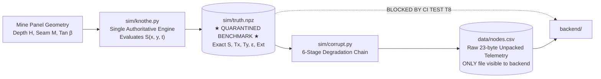

# Ground Truth Generation & Provenance Quarantine

**Module 04 — Physics Engine**  
**Cross-References:** [`knothe-model.md`](knothe-model.md) · [`corruption-chain.md`](corruption-chain.md) · [Module 05 Training Contract](../05-ai-ml-pipeline/training-contract.md)

---

## 1. Ground Truth Pipeline Architecture (`truth.npz`)

The simulator generates synthetic verification datasets that serve as the mathematical benchmark for evaluating the C7 cleaner, C8 detector, and C9 PINN surface reconstruction models.

---

## 2. Inviolable Quarantine Rule (Test T8)

To prevent circular data leakage and unrealistic performance claims:
* **The Rule:** The `backend/` directory has **zero import paths** from `truth/` or `sim/`.
* **CI Enforcement (Test T8):** An automated static analysis test verifies that executing `grep -rn "import truth" backend/` or attempting to import simulation truth classes from any backend file immediately raises `ModuleNotFoundError` and fails the build.
* **The Engineering Consequence:** The backend C7 and C8 pipelines operate in total blindness regarding the underlying mathematical truth, relying solely on degraded raw telemetry, sensor calibration manifest files (`nodes.json`), and the official DGMS blast register (`events.csv`).

---

## 3. The 3-Tier Data Provenance Model (Gate G04)

Every row of telemetry processed by AEGIS carries an explicit provenance tag to prevent AI/ML models from overfitting to synthetic simulation noise:

| Provenance Tag | Source of Observation | Physical Example | ML Training Loss Weight |
| :--- | :--- | :--- | :--- |
| `real` (real-world) | Physical ground sensors in active mines | Historical SCCL Adriyala leveling pegs, Sentinel-1 InSAR | **3.0× (Highest ground truth)** |
| `pinned` (physics-fit) | Empirical Knothe physics fitted to field data | Baseline elevation grid fitted to field draw angle | **1.0× (Physical baseline)** |
| `synthetic` (simulated) | Emulated edge cases and noise injection | Simulated sensor battery drop, packet fade, thermal walk | **0.1× (Penalized)** |

### Why Provenance Weighting Is Essential:
Commercial and academic AI systems frequently fail in field deployments because their neural networks are trained uniformly on synthetic data. The model inadvertently learns synthetic noise artifacts (such as synthetic battery discharge curves) as if they were true geological signals. By discounting synthetic rows by $10\times$ ($0.1\times$ loss weight), AEGIS forces the neural network to prioritize real-world physical constraints.

---

## 4. Bit-Identical Replay & Hash Validation (Test T37)

Simulation reproducibility is guaranteed through bit-identical deterministic execution:
* Terrain elevation accumulation is stored as signed 32-bit integers (`int32`) in millimeter units rather than floating-point values, eliminating cross-platform floating-point rounding discrepancies.
* The synthetic truth generator source file is cryptographically hashed at startup. The resulting SHA-256 digest is embedded directly into `truth.npz` metadata.
* Test `T37` asserts that re-running the 40-day scenario across different operating systems produces an identical SHA-256 hash.
