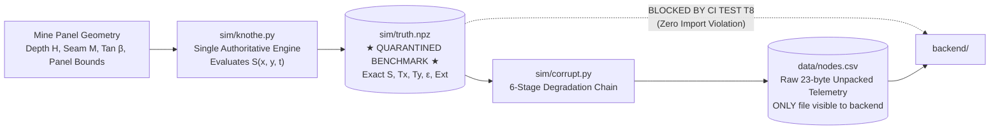

# Ground Truth Generation & Provenance Quarantine

**Module 04 — Physics Engine**  
**Cross-References:** [`knothe-model.md`](knothe-model.md) · [`corruption-chain.md`](corruption-chain.md) · [Module 05 Training Contract](../05-ai-ml-pipeline/training-contract.md) · [Module 08 Test Register](../08-verification/test-register.md)

---

## 1. Ground Truth Pipeline Architecture

### Question: What is the role of `truth.npz`, and why must an authoritative simulation ground truth exist prior to backend telemetry ingestion?

**Answer:** In physical geotechnical engineering, verifying whether a backend data processing pipeline correctly reconstructs ground movement or detects an impending collapse is impossible without an authoritative baseline. Field measurements are inherently sparse, noisy, and delayed.

The AEGIS physics engine (`sim/knothe.py`) generates a cryptographically hashed reference dataset, stored as `sim/truth.npz`. This dataset contains continuous, uncorrupted spatial and temporal tensors for vertical subsidence $S(x, y, t)$, biaxial tilt $(T_x, T_y)$, horizontal strain $(\varepsilon_x, \varepsilon_y)$, and extensometer displacements across the entire spatial domain of the mine panel.

This pristine dataset serves as the external "answer key" against which the backend calibration algorithms (C7 Corrector), alarm triggers (C8 Deterministic Detector), and neural surface reconstructions (C9 PINN) are rigorously evaluated:



---

## 2. Inviolable Quarantine Rule & Leakage Prevention

### Question: How does AEGIS ensure that the backend AI/ML models and alarm algorithms do not "cheat" by accessing simulation ground truth (Test T8)?

**Answer:** A frequent methodological flaw in AI research is data leakage, where production algorithms inadvertently import ground-truth parameters, labels, or uncorrupted signals from simulation modules. This creates artificially high benchmark scores that fail catastrophically when deployed in real mines.

AEGIS implements the **Inviolable Quarantine Rule**, enforced by automated CI Test `T8`:
1. **Total Namespace Isolation:** The production codebase under `backend/` has **zero import paths** from `sim/` or `truth/`.
2. **Automated Static Analysis Enforcement:** During every build, Test `T8` scans the entire repository:
   ```bash
   grep -rn -E "import truth|from sim import|from truth import" backend/
   ```
   If any backend script attempts to import synthetic truth classes or read `truth.npz`, the CI test immediately raises `ModuleNotFoundError` and aborts the deployment.
3. **Engineering Consequence:** The C7 filtering engine and C8 alarm detector operate in complete blindness regarding the mathematical truth. They process only the degraded raw telemetry emitted into `nodes.csv`, the static sensor hardware manifest (`nodes.json`), and the official DGMS blast register (`events.csv`).

---

## 3. The 3-Tier Data Provenance Model (Gate G04)

### Question: What is the 3-Tier Data Provenance Model, and why are synthetic simulation rows penalized with a 0.1× loss weight compared to real field data (3.0×)?

**Answer:** Real-world geotechnical deployments combine heterogeneous data streams: historical borehole leveling surveys, real-time wireless mesh sensor telemetry, satellite InSAR passes, and synthetic simulation data used to cover rare edge cases. Training deep neural networks indiscriminately across these sources causes catastrophic failure, because standard loss functions treat synthetic noise artifacts as genuine geological laws.

AEGIS enforces the **3-Tier Data Provenance Model (Gate G04)**, tagging every ingested telemetry record with an immutable provenance classification:

| Provenance Tag | Source of Observation | Physical Example | ML Training Loss Weight ($\omega_{\text{prov}}$) |
| :--- | :--- | :--- | :--- |
| `real` (real-world) | Physical ground sensors in active mines | Historical SCCL Adriyala leveling pegs, in-situ tiltmeters, Sentinel-1 InSAR | **3.0× (Authoritative ground truth)** |
| `pinned` (physics-fit) | Empirical Knothe physics fitted to field data | Baseline elevation grid fitted to field draw angle and depth | **1.0× (Physical baseline constraint)** |
| `synthetic` (simulated) | Emulated edge cases and noise injection | Simulated sensor battery drop, packet fade, thermal walk, synthetic faults | **0.1× (Penalized 10-fold)** |

### Geotechnical Rationale:
If a neural network is trained with uniform weighting on synthetic telemetry, it inadvertently learns synthetic artifacts—such as the exact discharge curve of a simulated lithium cell or the sinusoidal frequency of the thermal injection model—as if they were physical strata deformation laws.

By discounting synthetic telemetry rows by $10\times$ ($\omega_{\text{prov}} = 0.1$), AEGIS forces the C9 PINN optimizer to prioritize true geological signals while using synthetic data solely for structural regularization.

---

## 4. Deterministic Execution & Bit-Identical Replay

### Question: How does AEGIS guarantee scientific reproducibility across different operating systems and computational platforms (Test T37)?

**Answer:** Geotechnical safety audits require complete determinism. If an incident inquiry reconstructs a mine collapse scenario, running the simulation on an engineer's macOS workstation must produce the exact bit-for-bit trajectory as running on a Linux production cluster.

AEGIS enforces deterministic bit-identical execution through two mechanisms:

1. **Integer Quantization for Elevation Accumulation:**  
   Floating-point arithmetic across different CPU architectures (x86_64 vs. ARM64) introduces subtle IEEE 754 rounding variations in the least significant mantissa bits. Over a 40-day simulation with millions of numerical integration steps, this floating-point drift accumulates into visible trajectory divergence. AEGIS stores terrain elevation accumulation as signed 32-bit integers (`int32`) in millimeter units:
   $$z_{\text{integer}} = \text{round}(z_{\text{float}} \times 1000)$$
   Integer arithmetic is strictly deterministic and invariant across all CPU hardware architectures.

2. **Cryptographic SHA-256 Provenance Hashing (Test T37):**  
   At simulation initialization, the source code of the Knothe engine (`sim/knothe.py`) and its input configuration parameters are hashed using SHA-256. This cryptographic digest is embedded directly into the header metadata of `truth.npz`. Automated test `T37` asserts that re-running the 40-day advance scenario generates an identical SHA-256 hash. If any parameter or code dependency changes, the hash mismatch is flagged immediately.

---

## 5. Dynamic Spatial Scaling & Algorithmic Resolution

### Question: How does the ground truth generation engine adapt to varying mine panel dimensions rather than relying on hardcoded static grid setups?

**Answer:** The simulation engine does not depend on a rigid, hardcoded node count or fixed panel dimension. Instead, it scales dynamically according to the underlying Knothe physics:

1. **Physical Grid Domain Scaling:**  
   Given extraction panel coordinates $(x_1, y_1)$ to $(x_2, y_2)$ and overburden depth $H$, the physical domain expands laterally by $2.0 \cdot r$ along all boundaries to capture the full asymptotic decay of the subsidence basin:
   $$x_{\text{min}} = x_1 - 2r, \quad x_{\text{max}} = x_2 + 2r$$
   $$y_{\text{min}} = y_1 - 2r, \quad y_{\text{max}} = y_2 + 2r$$
2. **Dynamic Spatial Sampling:**  
   The numerical grid resolution is parameterized by the spatial Nyquist criterion ($\Delta \le r / 2.86$). For standard panels, a numerical resolution of $4001 \times 4001$ evaluates exact continuous integrals, which are then sampled at discrete physical sensor locations determined by the field deployment manifest (`nodes.json`).
3. **Temporal Advance Parameterization:**  
   The longwall face advance is modeled dynamically as a moving boundary $x_2(t) = x_1 + v_{\text{advance}} \cdot t$, enabling continuous evaluation of dynamic subsidence profiles for panels of arbitrary length and advance rate.
