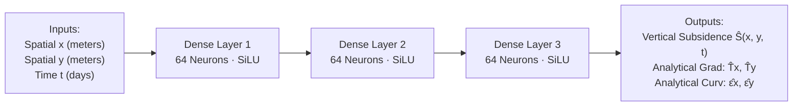

# Physics-Informed Neural Network (PINN) Architecture

**Module 05 — AI/ML Pipeline**  
**Cross-References:** [`loss-formulation.md`](loss-formulation.md) · [`training-contract.md`](training-contract.md) · [`safety-boundary.md`](safety-boundary.md)

---

## 1. Why Standard Deep Learning Fails on Mining Data

Standard black-box machine learning models (e.g., standard Multi-Layer Perceptrons, LSTMs, or generic spatial autoencoders) suffer from catastrophic failure modes when applied to sparse, noisy geotechnical sensor data:

```
+-----------------------------------------------------------------------------------+
|               CONVENTIONAL BLACK-BOX ML vs. PHYSICS-INFORMED PINN                 |
|                                                                                   |
|  Conventional Black-Box Regression (Unconstrained):                               |
|  - Hallucinates non-physical ground "heaving" (ground spontaneously rising).       |
|  - Creates sharp, discontinuous tears between distant sensor pegs.               |
|  - Fails catastrophically when sensor packets drop out during monsoons.           |
|                                                                                   |
|  Physics-Informed Neural Network (AEGIS C9):                                      |
|  - Hard-constrained by Knothe differential equations.                             |
|  - Smooth, physically admissible subsidence profiles guaranteed everywhere.       |
|  - Reliable spatial interpolation across unmonitored terrain blind spots.          |
+-----------------------------------------------------------------------------------+
```

Ground subsidence is governed by strict continuum mechanics, mass conservation, and strata compaction laws. A model that does not embed these physical laws will inevitably hallucinate non-physical terrain behavior when operating on sparse field measurements.

---

## 2. PINN Network Topology

The C9 PINN model takes continuous spatio-temporal coordinates as input and predicts continuous vertical displacement:

$$\hat{S} = \mathcal{N}(x, y, t; \, \mathbf{W}, \mathbf{b})$$



### Activation Function Selection (Test T35)
* Standard models frequently employ Rectified Linear Units (`ReLU`).
* **The Mathematical Breakdown:** Ground strain is the second spatial derivative of displacement ($\varepsilon \propto \partial^2 S / \partial x^2$). The second derivative of a piecewise linear ReLU function is **identically zero everywhere** ($d^2/dx^2[\max(0, x)] = 0$). Training a ReLU network on strain residual loss makes the physics loss constant and untrainable (verified by test `T35`).
* **The Fix:** AEGIS enforces smooth, twice-differentiable activation functions: **SiLU (Sigmoid Linear Unit / Swish)** or **Hyperbolic Tangent ($\tanh$)**, ensuring continuous non-zero second-order spatial gradients.

---

## 3. Parameter Invariance & Identifiability

The PINN does not attempt to learn the entire geotechnical environment from scratch. It partitions parameters into frozen rock invariants and dynamic learned coefficients:

| Parameter Category | Parameters | Handling Strategy |
| :--- | :--- | :--- |
| **Frozen Stratigraphic Invariants** | Seam depth $H$, draw angle $\tan\beta$, influence radius $r$, horizontal ratio $B_{\text{horiz}}$ | Hardcoded directly into the loss function graph; immutable |
| **Learned Field Parameters** | Effective subsidence coefficient $\hat{a}$, time factor coefficient $\hat{c}$ | Estimated dynamically by backpropagation through observed sensor data |

This hybrid structure restricts the neural network's degrees of freedom, preventing it from producing shapes that violate basic strata mechanics.
