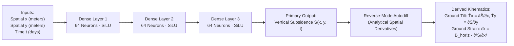

# Physics-Informed Neural Network (PINN) Architecture

**Module 05 — AI/ML Pipeline**  
**Cross-References:** [`loss-formulation.md`](loss-formulation.md) · [`training-contract.md`](training-contract.md) · [`safety-boundary.md`](safety-boundary.md) · [`surface-reconstruction.md`](surface-reconstruction.md) · [Module 08 Test Register](../08-verification/test-register.md)

---

## 1. Physical Motivation: Conventional Deep Learning vs. PINN

### Question: Why do conventional black-box deep learning architectures fail catastrophically when applied to sparse geotechnical mining data?

**Answer:** Standard black-box machine learning models (such as standard Multi-Layer Perceptrons, spatial CNNs, or recurrent LSTMs) operate as purely statistical function approximators without embedded physical priors. When deployed on sparse, noisy mining sensor arrays, they exhibit fatal failure modes:

```
+-----------------------------------------------------------------------------------+
|               CONVENTIONAL BLACK-BOX ML vs. PHYSICS-INFORMED PINN                 |
|                                                                                   |
|  Conventional Black-Box Regression (Unconstrained):                               |
|  - Hallucinates non-physical ground "heaving" (ground spontaneously rising).       |
|  - Creates sharp, discontinuous tears between distant sensor stations.            |
|  - Fails catastrophically when sensor packets drop out during monsoon outages.    |
|  - Violates subterranean mass conservation identities.                            |
|                                                                                   |
|  Physics-Informed Neural Network (AEGIS C9):                                      |
|  - Hard-constrained by Knothe differential equations embedded in the loss graph.   |
|  - Smooth, physically admissible subsidence profiles guaranteed everywhere.       |
|  - Robust spatial interpolation across unmonitored terrain blind spots.           |
|  - Enforces bedrock anchor stability and asymptotic boundary decay.               |
+-----------------------------------------------------------------------------------+
```

Subsurface strata deformation is governed by continuum mechanics, mass conservation, and rheological compaction. A model lacking these differential constraints will produce mathematically unphysical surface profiles between sparse sensor stations, hallucinating spontaneous terrain uplifts or extreme step-function tears that misinform safety engineers.

---

## 2. Neural Network Topology & Continuous Space-Time Mapping

### Question: What is the specific network topology of the C9 PINN, and how does it map continuous space-time coordinates to kinematic deformation fields?

**Answer:** The C9 PINN is formulated as a continuous coordinate-based neural field. It takes spatio-temporal coordinates as input and predicts continuous vertical subsidence:

$$\hat{S} = \mathcal{N}(x, y, t; \, \mathbf{W}, \mathbf{b})$$

Where:
* $(x, y)$ = Spatial surface coordinates in meters relative to the mine panel origin.
* $t$ = Elapsed time in days since seam extraction commenced.
* $\mathbf{W}, \mathbf{b}$ = Trainable weight matrices and bias vectors.



### Network Hyperparameters:
* **Architecture:** Fully connected multi-layer perceptron (3 hidden layers, 64 neurons per layer).
* **Parameter Count:** $\approx 8,640$ trainable parameters, ensuring high expressive capacity for smooth Gaussian bowls while remaining ultra-lightweight for rapid edge retraining on CPU or embedded GPU hardware.
* **Continuous Resolution:** Because inputs are continuous coordinates $(x, y, t)$, the network can be queried at arbitrary spatial resolutions (e.g., $64 \times 64$ or $256 \times 256$ meshes) without re-interpolation artifacts.

---

## 3. Activation Function Selection & Second-Derivative Vanishing Gradient

### Question: Why is the standard Rectified Linear Unit (ReLU) activation function mathematically incapable of training geotechnical physics models, and why does AEGIS mandate SiLU or $\tanh$ (Test T35)?

**Answer:** In standard computer vision and natural language processing, Rectified Linear Units ($\text{ReLU}(z) = \max(0, z)$) are favored for computational simplicity. In physics-informed neural networks that model geotechnical strain, **ReLU is mathematically fatal**.

**The Mathematical Breakdown (Test T35):**
1. Ground tilt is the first spatial derivative:
   $$\hat{T}_x = \frac{\partial \hat{S}}{\partial x}$$
2. Horizontal ground strain $\hat{\varepsilon}_x$ is the second spatial derivative (curvature):
   $$\hat{\varepsilon}_x = B_{\text{horiz}} \cdot \frac{\partial^2 \hat{S}}{\partial x^2}$$
3. For a neural network with piecewise linear activation $\text{ReLU}(z)$:
   $$\frac{d}{dz}\text{ReLU}(z) = \begin{cases} 1 & z > 0 \\ 0 & z < 0 \end{cases} \implies \frac{d^2}{dz^2}\text{ReLU}(z) \equiv \mathbf{0} \quad (\forall z \ne 0)$$
4. The second spatial derivative of a ReLU network is identically zero everywhere except at discrete sharp non-differentiable elbows.
5. If the PINN loss includes curvature physics or strain data terms, the gradient with respect to network weights vanishes identically:
   $$\nabla_{\mathbf{W}} \left( \frac{\partial^2 \hat{S}}{\partial x^2} \right) \equiv \mathbf{0}$$

Automated test `T35` demonstrates that replacing the activation function with ReLU forces the strain residual loss into a constant, unlearnable state.

**The Architectural Mandate:**  
AEGIS enforces smooth, infinitely differentiable ($C^\infty$) activation functions:
* **SiLU (Sigmoid Linear Unit / Swish):** $\sigma_{\text{SiLU}}(z) = z \cdot \frac{1}{1 + e^{-z}}$, which provides non-zero, continuously varying first and second derivatives while maintaining efficient gradient propagation.
* **Hyperbolic Tangent ($\tanh$):** Used optionally for strict asymptotic saturation at far-field boundaries.

---

## 4. Parameter Partitioning & Scientific Identifiability

### Question: How does AEGIS partition geotechnical parameters into frozen invariants versus dynamically learned parameters, and how is parameter cheating prevented (Test T32)?

**Answer:** If a neural network is tasked with estimating every geological parameter from scratch (panel depth, draw angle, seam thickness, subsidence factor, relaxation time), the inverse problem becomes severely ill-posed and non-identifiable. Multiple conflicting parameter combinations can fit sparse sensor readings equally well.

AEGIS resolves this through a **Hybrid Parameter Partitioning Strategy**:

| Parameter Category | Parameters | Handling Strategy | Justification |
| :--- | :--- | :--- | :--- |
| **Frozen Stratigraphic Invariants** | Seam depth $H$, draw angle $\tan\beta$, influence radius $r = H/\tan\beta$, Awershin ratio $B_{\text{horiz}} = 0.32 r$ | Hardcoded directly into the PyTorch loss computational graph; immutable constants | Known from direct exploratory borehole core drilling and stratigraphic logs. |
| **Learned Field Parameters** | Effective subsidence factor $\hat{a}$, time decay constant $\hat{c}$ | Instantiated as trainable `nn.Parameter` tensors optimized via backpropagation | Represent dynamic field variables that vary with longwall advance rate and strata caving behavior. |

### Prevention of Ground Truth Cheating (Test T32):
To guarantee that the PINN model does not artificially "cheat" by accessing private simulation constants, automated CI Test `T32` performs a strict static analysis scan across `backend/c9/`:
```bash
grep -rn -E "site\.a|site\.c|S_MAX|truth" backend/c9/
```
If any reference to the simulation ground-truth constants appears within the C9 inference or training scripts, the CI pipeline fails immediately. The PINN must infer $\hat{a}$ and $\hat{c}$ purely through gradient descent on the observational telemetry and PDE residual loss.
