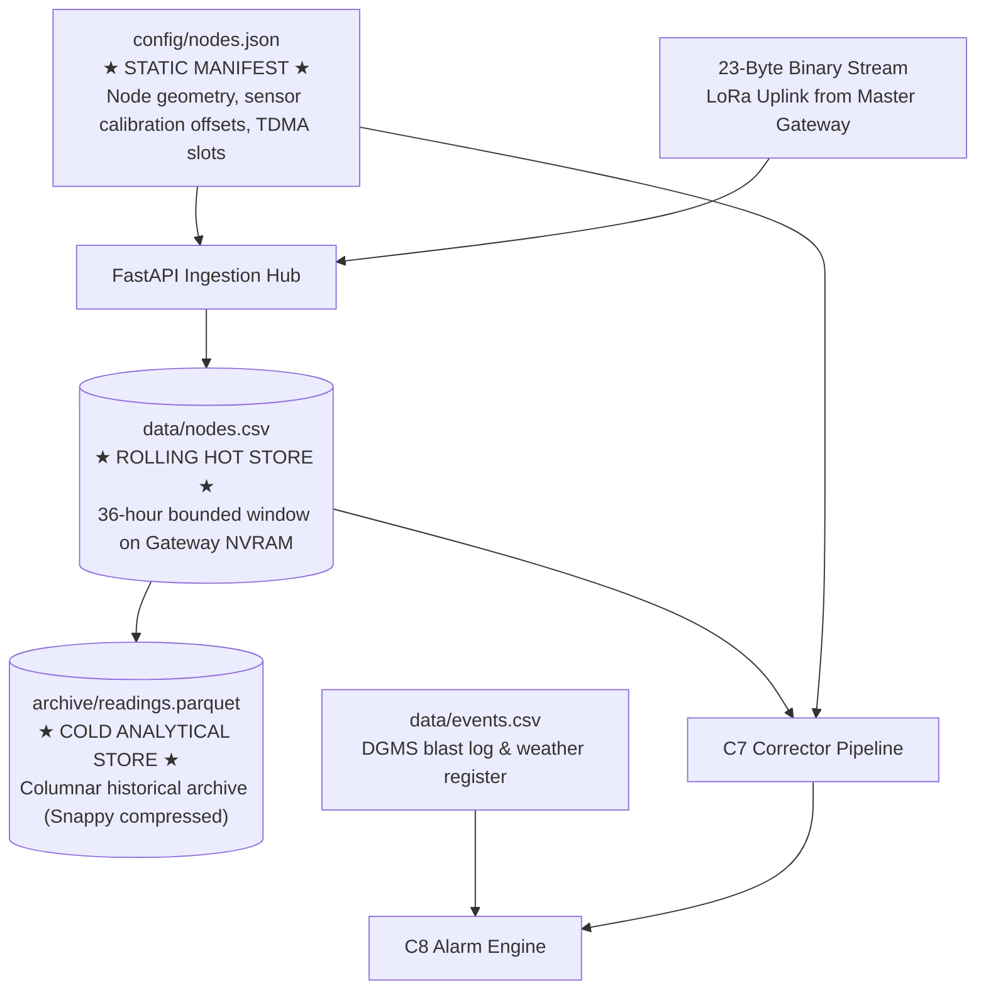

# Backend Data Architecture & Ingestion Schemas

**Module 06 — Backend Pipeline**  
**Cross-References:** [`c7-corrector.md`](c7-corrector.md) · [`c8-alarm-engine.md`](c8-alarm-engine.md) · [Module 03 Wire Format](../03-mesh-networking/wire-format.md)

---

### Question: What is the overall data flow and storage hierarchy of the AEGIS backend platform?
**Answer:** The AEGIS backend coordinates incoming wireless telemetry, calibration transformations, deterministic hazard detection, and historical archival across four tightly integrated storage artifacts organized into hot, warm, and cold tiers:



1. **Static Manifest (`config/nodes.json`):** Commissioning baseline defining station spatial coordinates, sensor calibration constants, and network schedules.
2. **Rolling Hot Store (`data/nodes.csv`):** Bounded 36-hour memory-mapped or flash-backed buffer holding uncompressed recent telemetry for instantaneous calibration and rolling baseline calculations.
3. **Cold Analytical Archive (`archive/readings.parquet`):** Highly compressed, columnar historical store storing multi-month deployment records for analytical re-processing and DGMS statutory audits.
4. **Statutory Register (`data/events.csv`):** DGMS-compliant ledger recording scheduled explosive detonations and seismic blast parameters.

---

### Question: Why does AEGIS implement a 36-hour bounded rolling store (`nodes.csv`), and how is this retention floor mathematically derived?
**Answer:** Unbounded append-only CSV logging causes memory bloat, disk exhaustion, and degraded query times on edge hardware (e.g., Raspberry Pi Compute Module or industrial embedded gateways) during multi-month or multi-year mining deployments. 

To eliminate this, AEGIS enforces a strict mathematical retention floor:
* The C8 Safety Engine calculates baseline ground deformation trends using a **24-hour rolling median filter** (`baseline_window_h = 24`) to eliminate diurnal thermal cycles.
* When gateway power is interrupted or cellular backhaul reconnects after an outage, mesh buffers burst queued packets into the ingestion hub. If the hot store held exactly 24 hours of data, backhaul catch-up operations would experience boundary starvation, corrupting rolling window calculations.
* Therefore, the hot store retention period ($\tau_{\text{retention}}$) is bounded by a $1.5\times$ safety headroom factor:

$$\tau_{\text{retention}} \ge \tau_{\text{baseline}} \times 1.5 = 24\text{ hours} \times 1.5 = \mathbf{36\text{ hours}}$$

Telemetry rows older than 36 hours are continuously flushed into columnar cold storage, ensuring that `nodes.csv` maintains an invariant footprint regardless of whether the system has operated for 3 days or 3 years.

---

### Question: How does storage footprint scale dynamically with grid density and Knothe panel geometry, and how does Test T30 verify this bound?
**Answer:** Rather than assuming an arbitrary, static node count, AEGIS models storage sizing as a dynamic function of the panel extraction geometry. Under Knothe subsidence physics, sensor grid density is determined by the panel width ($W$), panel length ($L$), and depth of cover ($H$). The total active station count $N_{\text{nodes}}$ is governed by the physical grid resolution required to resolve the inflection point of the subsidence basin:

$$N_{\text{nodes}} = N_{\text{scouts}} + N_{\text{anchors}} + N_{\text{borehole}}$$

Given an individual station transmission period ($\Delta t_{\text{transmit}}$) and a row serialization footprint of $S_{\text{row}} \approx 120\text{ bytes/row}$, the mathematical maximum row capacity and flash memory footprint of `nodes.csv` are strictly bounded:

$$\text{Max Rows} = N_{\text{nodes}} \times \left( \frac{\tau_{\text{retention}} \times 3600\text{ s}}{\Delta t_{\text{transmit}}} \right)$$
$$\text{Max Disk Footprint} = \text{Max Rows} \times S_{\text{row}}$$

The following table demonstrates dynamic scaling across varied mining deployments with a nominal 60-second transmission interval ($\Delta t_{\text{transmit}} = 60\text{ s}$, $\tau_{\text{retention}} = 36\text{ h}$):

| Mining Deployment Profile | Grid Stations (N_nodes) | Max Rows in Hot Store | Max Disk Footprint | Peak RAM Buffer |
| :--- | :--- | :--- | :--- | :--- |
| **Pilot Demonstration Panel** | 16 stations | 34,560 rows | 4.15 MB | < 8 MB |
| **Standard Longwall Panel** | 36 stations | 77,760 rows | 9.33 MB | < 16 MB |
| **High-Resolution Continuous Miner**| 64 stations | 138,240 rows | 16.59 MB | < 28 MB |
| **Regional Multi-Panel Lease** | 128 stations | 276,480 rows | 33.18 MB | < 55 MB |

Continuous integration test `T30` validates this bounded behavior by feeding 100,000 synthetic epochs into the ingestion pipeline. The test verifies that the pruning worker triggers at $T > 36\text{ h}$, accurately moves aged rows to Parquet, and caps file size at the theoretical bound within a $\pm 1\%$ tolerance.

---

### Question: What is the exact data schema of the static commissioning manifest (`nodes.json`), and what role does it play in C7 calibration?
**Answer:** The static manifest `config/nodes.json` defines the physical identity, spatial coordinates, mesh networking slots, and laboratory calibration constants for every deployed station. This file is cryptographically signed and frozen during site commissioning:

```json
{
  "node_id": 14,
  "role": "scout_tier_1b",
  "coord_m": [340.0, 185.0, 0.0],
  "primary_parent": 2,
  "backup_parent": 3,
  "tdma_slot": 4,
  "backup_slot": 12,
  "sensors": {
    "strain": {
      "adc_channel": 0,
      "gauge_factor": 2.14,
      "rod_length_m": 10.0,
      "k_T": 5.2,
      "zero_offset_raw": 1024
    },
    "tilt": {
      "i2c_addr": "0x68",
      "k_T": 250.0,
      "cal_offset_urad": [-12, 45]
    },
    "vbat": {
      "divider_ratio": 2.0,
      "v_nom": 3700,
      "alpha_sag": 0.042
    }
  }
}
```

#### Calibration Role:
* `coord_m`: Provides ground-truth Cartesian coordinates $(X, Y, Z)$ relative to the mine lease benchmark, required by C8 for 5-station spatial quorum neighbor lookups and by C9 PINN for spatial loss evaluation.
* `k_T`: Specifies transducer-specific thermal drift coefficients ($k_{T, \text{strain}}$ in $\mu\varepsilon/^\circ\text{C}$ and $k_{T, \text{tilt}}$ in $\mu\text{rad}/^\circ\text{C}$) used in Step 4 of the C7 pipeline.
* `alpha_sag`: Governs ADC reference voltage sag compensation as battery voltage fluctuates under solar charge/discharge cycles in Step 3.

---

### Question: What is the structure of the statutory blast register (`events.csv`), and how does it interface with DGMS Circular 7 of 1997?
**Answer:** Under DGMS Circular 7 of 1997, all open-cast and underground blasting operations must maintain a certified register of explosive charges, initiation times, and location coordinates. AEGIS ingests this ledger via `data/events.csv`:

```csv
timestamp_utc,event_type,charge_weight_kg,seam_level,panel_x,panel_y,status
2026-09-27T10:30:00Z,PRODUCTION_BLAST,120.5,SEAM_1,450.0,200.0,CONFIRMED
2026-09-27T14:15:00Z,DEVELOPMENT_BLAST,45.0,SEAM_2,520.0,210.0,CONFIRMED
```

The C8 Safety Alarm Engine reads this register in real time. When an anomalous seismic impulse or vibration surge exceeds $15\text{ mm/s}$, C8 performs a temporal-spatial join against `events.csv`:
1. **Match Condition:** If $|\text{time}_{\text{reading}} - \text{timestamp}_{\text{utc}}| \le 5\text{ seconds}$ and the sensor is within the predicted vibration radius for `charge_weight_kg`, the transient reading is classified as `vetoed_by = BLAST_REGULAR`, preventing siren trip.
2. **Mismatch Condition:** If high vibration occurs without an authorized matching row, C8 immediately trips a Class-A Unlogged Blast / Seismic Shock Alert.

---

### Question: Why is historical telemetry archived in columnar Apache Parquet format (`readings.parquet`) rather than traditional relational SQL or flat CSV tables?
**Answer:** While flat CSV is ideal for zero-dependency streaming ingestion on edge microcontrollers, it is highly inefficient for multi-month geotechnical queries. Archiving long-term telemetry in Apache Parquet with Snappy compression delivers three decisive technical advantages:

1. **Storage Footprint Reduction (85% Compression):** Geotechnical sensor telemetry contains slowly varying continuous physical states (die temperature, battery voltage, slow ground creep). Parquet's run-length encoding (RLE), dictionary encoding, and Snappy compression reduce raw telemetry footprints by over $85\%$ compared to uncompressed CSV:
   $$\text{Storage Footprint (1 year, 64 nodes)}: \approx 2.4\text{ GB (CSV)} \longrightarrow \approx 360\text{ MB (Parquet)}$$
2. **Columnar Projection & Vectorized Slicing:** Safety investigations and geotechnical calibration routines rarely inspect every sensor channel simultaneously. An investigator plotting a 6-month extensometer curve reads only the `timestamp` and `strain_ue` columns. Parquet reads only the target byte ranges from disk, cutting I/O bandwidth by $80\text{--}90\%$.
3. **Partition Pruning:** Parquet archives are partitioned by `year=YYYY/month=MM/node_id=NN`. Time-range queries executed by Polars, DuckDB, or Pandas skip non-relevant partitions entirely, allowing the 690-day historical time scrubber in the operator dashboard to execute instant bit-identical historical replays in $< 150\text{ ms}$.
