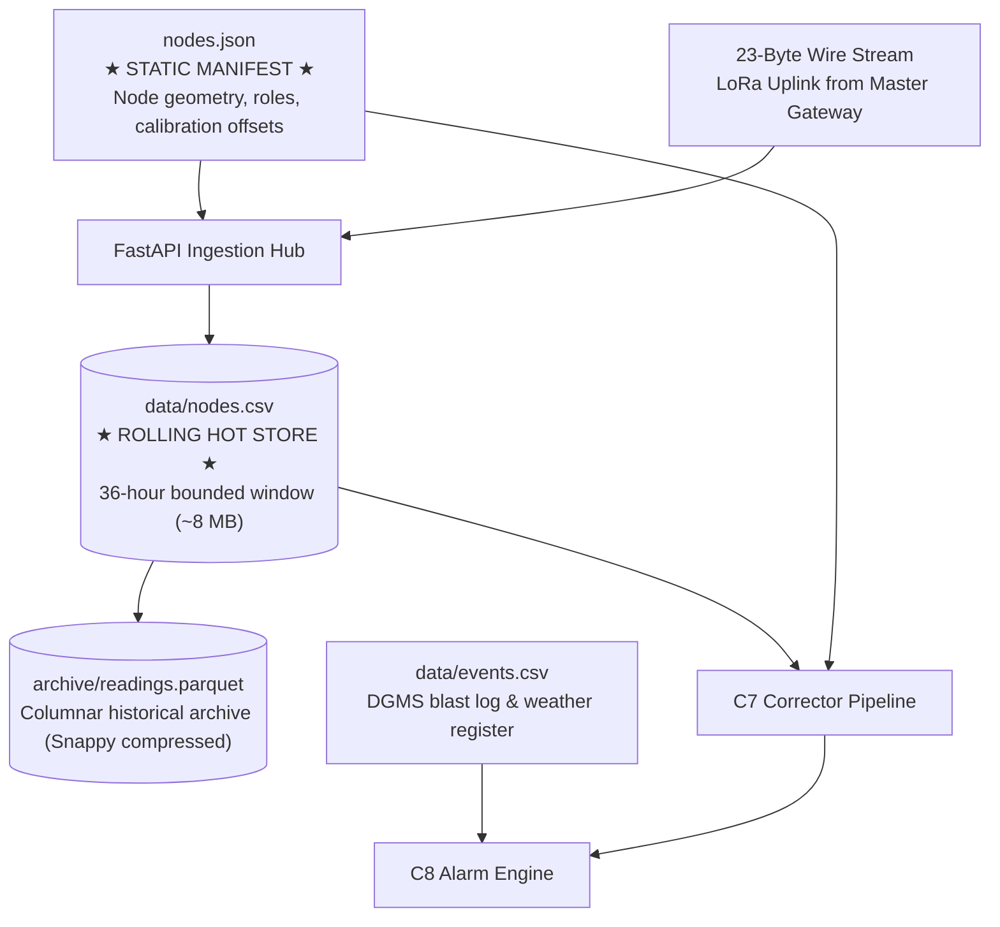

# Backend Data Architecture & Ingestion Schemas

**Module 06 — Backend Pipeline**  
**Cross-References:** [`c7-corrector.md`](c7-corrector.md) · [`c8-alarm-engine.md`](c8-alarm-engine.md) · [Module 03 Wire Format](../03-mesh-networking/wire-format.md)

---

## 1. File Ecosystem & Data Relationships

The AEGIS backend coordinates telemetry ingestion, state calibration, and safety evaluation across four structured file artifacts:



---

## 2. Telemetry Retention: The 36-Hour Bounded Store (`nodes.csv`)

In early versions, raw telemetry was written to an unbounded append-only CSV file, which swelled to hundreds of megabytes over a multi-month deployment, degrading query performance and causing out-of-memory errors on edge gateway hardware.

AEGIS implements a **36-Hour Bounded Rolling Store** governed by a strict mathematical floor:

### 1. Retention Mathematical Floor
The C8 safety engine calculates baseline ground movement using a **24-hour rolling median window** (`baseline_window_h = 24`). To guarantee that median calculations never suffer boundary starvation during backhaul catch-up:

$$\text{retention\_h} \ge \text{baseline\_window\_h} \times 1.5 = 24\text{ h} \times 1.5 = \mathbf{36\text{ hours}}$$

### 2. Bounded Storage Footprint (Test T30)
The maximum size of `nodes.csv` is bounded and independent of whether the system has been operating for 3 days or 300 days:

$$\text{Max Rows} = N_{\text{nodes}} \times \left( \frac{\text{retention\_h} \times 3600\text{ s}}{\text{transmit\_s}} \right) = 37 \times \left(\frac{36 \times 3600}{60}\right) = \mathbf{79,920\text{ rows}}$$
$$\text{Max Disk Size} \approx 79,920\text{ rows} \times 120\text{ bytes/row} \approx \mathbf{9.59\text{ MB}}$$

When rows age beyond 36 hours, an asynchronous worker flushes them into `readings.parquet` and truncates `nodes.csv` (verified by test `T30`).

---

## 3. Configuration Manifest: `nodes.json`

The calibration personality and physical coordinates of each deployed station are defined in `config/nodes.json`. This file is frozen during site commissioning:

```json
{
  "node_id": 14,
  "role": "scout_tier_1b",
  "coord_m": [340.0, 185.0, 0.0],
  "primary_parent": 2,
  "backup_parent": 3,
  "tdma_slot": 4,
  "backup_slot": 12,
  "sensors": {
    "strain": {"adc_channel": 0, "gauge_factor": 2.1, "rod_length_m": 10.0, "k_T": 5.0},
    "tilt": {"i2c_addr": "0x68", "k_T": 250.0, "cal_offset_urad": [-12, 45]},
    "vbat": {"divider_ratio": 2.0, "v_nom": 3700}
  }
}
```

---

## 4. Blast & Environmental Register: `events.csv`

In compliance with DGMS Circular 7 of 1997, all scheduled underground explosive detonations are recorded in `data/events.csv`:

```csv
timestamp_utc,event_type,charge_weight_kg,seam_level,panel_x,panel_y,status
2026-09-27T10:30:00Z,PRODUCTION_BLAST,120.5,SEAM_1,450.0,200.0,CONFIRMED
2026-09-27T14:15:00Z,DEVELOPMENT_BLAST,45.0,SEAM_2,520.0,210.0,CONFIRMED
```

The C8 alarm engine reads this file to cross-reference transient vibration spikes and veto false alarms.
