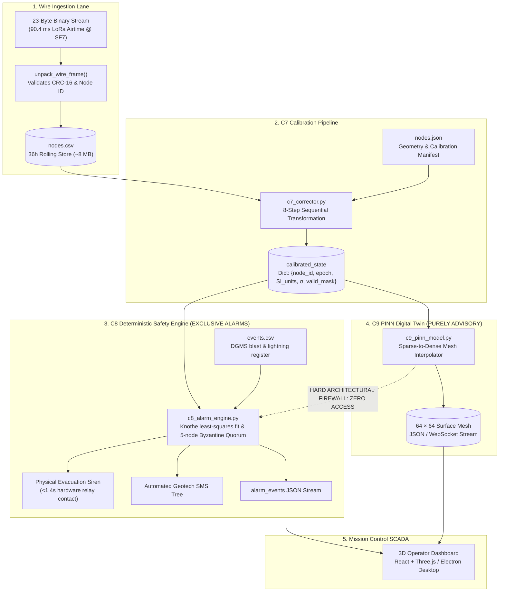

# Pipeline Flow: End-to-End Execution & Data Contracts

**Module 06 — Backend Pipeline**  
**Cross-References:** [`data-architecture.md`](data-architecture.md) · [`c7-corrector.md`](c7-corrector.md) · [`c8-alarm-engine.md`](c8-alarm-engine.md)

---

## 1. End-to-End Pipeline Execution Flow

The AEGIS backend coordinates incoming wireless telemetry, calibration transformations, deterministic hazard detection, and 3D terrain reconstruction across a deterministic execution graph:

---

## 2. Stage-by-Stage Latency & Data Contract Ledger

| Stage | Input Data Structure | Output Data Structure | Typical Latency | Primary Failure Guard |
| :--- | :--- | :--- | :--- | :--- |
| **Ingestion** | 23-byte binary LoRa frame | Row in `nodes.csv` (120 bytes) | $< 15\text{ ms}$ | CRC-16 error rejection; de-dup ring |
| **C7 Cleaning**| Raw `nodes.csv` + `nodes.json` | Calibrated state dictionary (SI units) | $< 35\text{ ms}$ | Sag undo prior to thermal subtraction |
| **C8 Quorum** | Calibrated state + `events.csv` | Alarm classification (Quiet/Warn/Crit) | $< 10\text{ ms}$ | 5-node Byzantine quorum + DGMS blast veto |
| **Siren Action**| Dry-contact relay command | 125 dB physical audio siren | $< 250\text{ ms}$ | Local hardware latch; independent of internet |
| **C9 Twin** | Calibrated state (48 time slices) | $64 \times 64$ elevation & strain mesh | $\sim 45\text{ s}$ (Async)| PINN decoupled from real-time alarm loop |

### Inviolable Firewall Check:
The line from C9 to C8 is non-existent. At no point in the code can C9 outputs, predictions, or tensor weights be imported or read by C8 routines, ensuring complete DGMS regulatory auditability.
