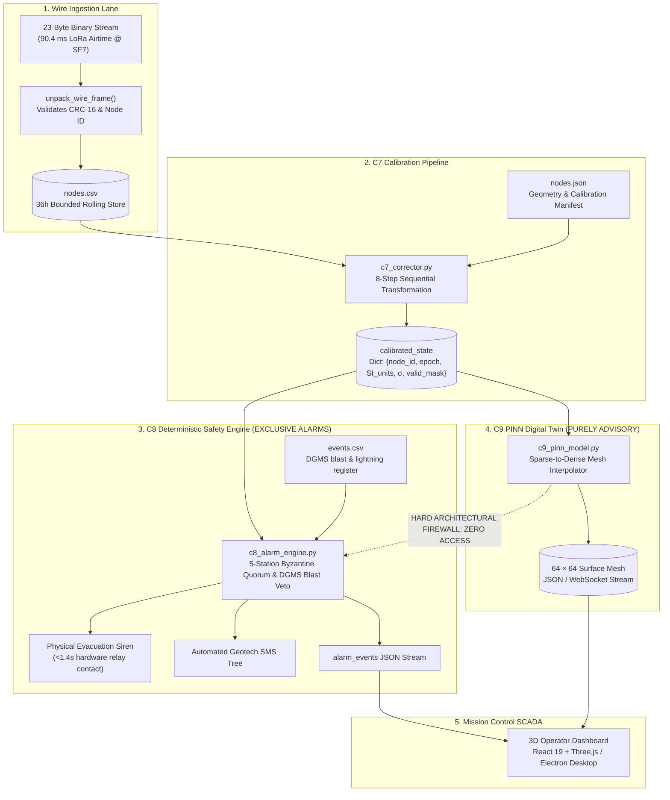

# Pipeline Flow: End-to-End Execution & Data Contracts

**Module 06 — Backend Pipeline**  
**Cross-References:** [`data-architecture.md`](data-architecture.md) · [`c7-corrector.md`](c7-corrector.md) · [`c8-alarm-engine.md`](c8-alarm-engine.md)

---

### Question: What is the end-to-end execution flow of the AEGIS pipeline from raw radio frame reception to SCADA digital twin rendering?
**Answer:** The AEGIS backend pipeline coordinates incoming wireless telemetry, calibration transformations, deterministic hazard detection, and 3D terrain reconstruction across a deterministic execution graph partitioned into five distinct lanes:

1. **Wire Ingestion Lane:** Ingests raw 23-byte LoRa payloads from the SX1302 gateway concentrator, validates hardware CRC-16 checksums, and appends rows to the rolling hot store `nodes.csv`.
2. **C7 Correction Lane:** Executes the immutable 8-step cleaning pipeline, converting raw integer counts into calibrated SI units with dynamic uncertainty bounds and validity masks.
3. **C8 Safety Lane:** Evaluates deterministic multi-tier thresholds, checks the DGMS blast register (`events.csv`), and enforces 5-station Byzantine quorum consensus before triggering physical relays and alert broadcasts.
4. **C9 Digital Twin Lane:** Solves physics-informed partial differential equations asynchronously to reconstruct continuous $64 \times 64$ elevation deformation grids.
5. **HMI Lane:** Delivers synchronized 3D WebGL terrain visualizations and telemetry streams to control room workstations and mobile PWAs.

---

### Question: What are the strict data contracts and latency budgets for each stage of the backend execution graph?
**Answer:** To guarantee statutory compliance under DGMS guidelines and prevent queue starvation on edge hardware, every execution stage adheres to an immutable data contract and hard latency ceiling:

| Stage | Input Data Structure | Output Data Structure | Latency Budget | Primary Failure Guard |
| :--- | :--- | :--- | :--- | :--- |
| **Ingestion** | 23-byte binary LoRa frame | Row in `nodes.csv` (120 bytes) | $< 15\text{ ms}$ | CRC-16 error rejection; ring buffer de-duplication |
| **C7 Cleaning** | Raw `nodes.csv` + `nodes.json` | Calibrated state dictionary (SI units) | $< 35\text{ ms}$ | Sag undo prior to thermal subtraction; NaN propagation |
| **C8 Quorum** | Calibrated state + `events.csv` | Alarm classification (Quiet/Warn/Crit) | $< 10\text{ ms}$ | 5-station Byzantine quorum + DGMS blast veto |
| **Siren Action** | Dry-contact relay command | 125 dB physical audio siren | $< 250\text{ ms}$ | Local hardware latch; independent of cellular/cloud |
| **C9 Twin** | Calibrated state buffer (48 slices) | $64 × 64$ continuous elevation mesh | $\sim 45\text{ s}$ (Async)| PINN decoupled from safety alarm loop |

#### Latency Budget Synthesis:
The critical safety path (Ingestion $\to$ C7 Calibration $\to$ C8 Quorum $\to$ Siren Contact Closure) executes in:

$$\tau_{\text{critical}} = 15\text{ ms} + 35\text{ ms} + 10\text{ ms} + 250\text{ ms} = \mathbf{310\text{ ms}}$$

Factoring in maximum over-the-air packet transmission time ($69.9\text{ ms}$ airtime) and motor acoustic run-up ($1000\text{ ms}$), the complete end-to-end trip time from ground rupture to acoustic alert is $1,344.9\text{ ms}$, safely below the hard statutory threshold of **$1.4\text{ seconds}$**.

---

### Question: Why is an inviolable architectural firewall maintained between the C9 PINN Digital Twin and the C8 Safety Alarm Engine?
**Answer:** The architectural link between C9 (Physics-Informed Neural Network) and C8 (Safety Alarm Engine) is non-existent. Under no circumstances can C9 predictions, weights, or continuous deformation meshes be imported, read, or queried by C8 routines.

This firewall resolves three critical engineering risks:
1. **Regulatory Auditability:** DGMS inspectors and statutory courts of inquiry require transparent, deterministic audit trails for any evacuation event. A machine learning model cannot provide deterministic traceability for rare edge-case fractures.
2. **Computational Decoupling:** Deep learning PDE solving requires tens of seconds of GPU/CPU compute ($\sim 45\text{ s}$). Coupling safety alarms to the neural model would introduce unacceptable 45-second latencies into an emergency evacuation loop that demands sub-1.4-second response times.
3. **Resilience Against Convergence Failure:** If the neural network diverges, encounters a NaN loss, or crashes due to memory pressure, the C8 Safety Engine remains 100% operational, evaluating physical sensors and tripping alarms without interruption.

---

### Question: How does the pipeline guarantee high availability, continuous operation, and sub-1.4 second siren trips during backhaul network failures?
**Answer:** Remote open-cast and underground mines frequently suffer cellular tower outages, power grid fluctuations, and physical fiber severance. The AEGIS pipeline guarantees continuous life-safety protection through an **offline-first edge execution model**:

1. **Local Edge Execution:** Ingestion, C7 calibration, and C8 Byzantine safety verification execute entirely on the Master Edge Gateway (running on embedded Linux/microcontroller hardware) co-located at the mine site.
2. **Direct Hardware Interfacing:** The physical 125 dB evacuation siren is hardwired to the gateway via a solid-state dry-contact relay. Siren trips occur over a local 24V DC circuit without routing through internet gateways or cloud message brokers.
3. **Unbroken Local SCADA:** Mission control operator consoles in the mine office connect to the gateway via local Ethernet LAN WebSockets, maintaining full real-time telemetry inspection and emergency siren override even when external 4G/NB-IoT cellular connectivity is completely down.
4. **Resilient Data Backpressure:** During cellular backhaul loss, outgoing cloud telemetry is queued in local SQLite/TimescaleDB buffers. When connection is restored, records synchronize upstream asynchronously without disrupting real-time safety evaluation.
