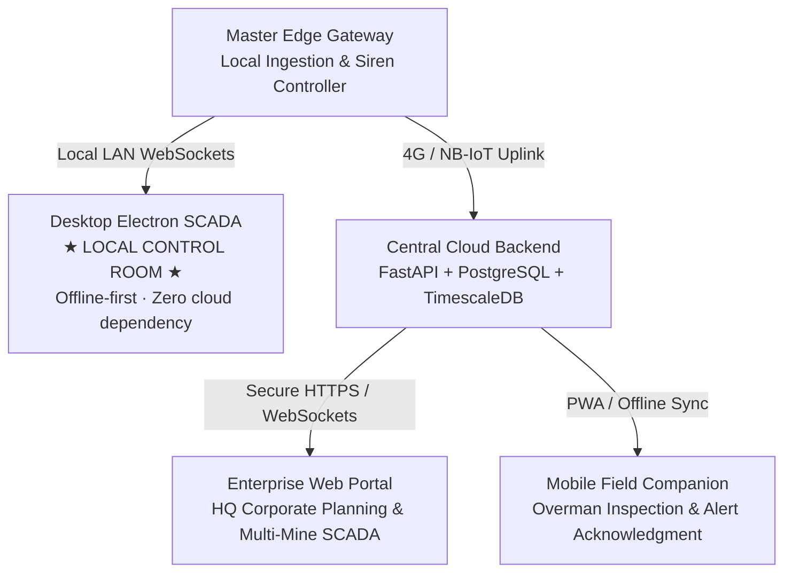

# Web, Desktop & Mobile Platform Architecture

**Module 07 — Digital Twin & UI**  
**Cross-References:** [`3d-visualization.md`](3d-visualization.md) · [`operator-dashboard.md`](operator-dashboard.md) · [Module 06 Data Architecture](../06-backend-pipeline/data-architecture.md)

---

## 1. Unified Software Architecture

The user interface layer is built around a cross-platform TypeScript and React architecture delivering synchronized situational awareness across control room desktop workstations, enterprise web portals, and ruggedized field tablets.

---

## 2. Desktop Electron Application (Offline-First Control Room)

In remote mining coalfields (e.g., Godavari Valley, Singrauli, Korba), public telecommunications links suffer frequent fiber cuts and weather disruptions.
* **The Problem:** A cloud-hosted web application stops functioning during internet outages, leaving the mine control room blind.
* **The Solution:** The primary control room interface runs as an **Electron desktop application** communicating directly with the Master Gateway over the local mine Ethernet LAN.
* **Local Caching:** Telemetry, alert queues, and terrain state are cached locally in an on-premise TimescaleDB instance. Full SCADA monitoring, 3D visualization, and emergency siren control function with **zero dependency on external internet connectivity**.

---

## 3. Mobile Companion Application (Field Inspection PWA)

Mining Overmen, Surveyors, and Geotechnical Engineers operate on foot across active subsidence panels. AEGIS provides a lightweight, ruggedized Progressive Web App (PWA):
* **Field Inspection Checklists:** Surveyors inspect ground fissures, record crack widths with digital calipers, and log photographic evidence directly into the central database.
* **Alert Acknowledgment:** Field supervisors receive immediate push notifications and can acknowledge advisory alerts with a single tap.
* **Offline Synchronization:** Observations recorded in radio shadow zones (e.g., inside deep opencast cuts) are stored locally in IndexedDB and synchronize automatically upon re-entering LoRa/Wi-Fi coverage.

---

## 4. API & WebSocket Communication Contracts

Real-time and historical telemetry are exposed through standardized, secure interfaces:

### 1. High-Speed WebSocket Feed (`/ws/live`)
* Delivers live telemetry rows, link quality updates, and alarm events with $< 100\text{ ms}$ latency.
* Uses binary protocol buffers or compact JSON to minimize network bandwidth over cellular telemetry connections.

### 2. Analytical REST API Endpoints
* `GET /api/v1/nodes`: Retrieves the active configuration manifest, sensor calibration constants, and 3D coordinates.
* `GET /api/v1/telemetry/historical`: Queries columnar Parquet archives for arbitrary time windows and node subsets.
* `POST /api/v1/alarms/acknowledge`: Cryptographically signs and logs operator alert acknowledgments for DGMS statutory audits.
