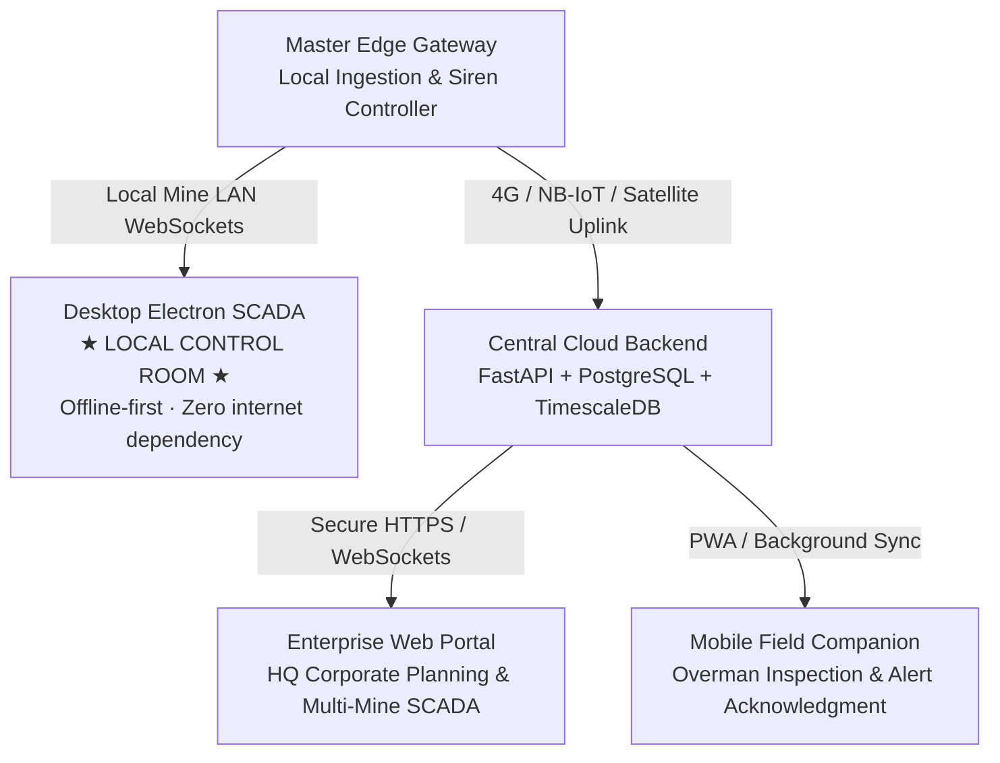

# Web, Desktop & Mobile Platform Architecture

**Module 07 — Digital Twin & UI**  
**Cross-References:** [`3d-visualization.md`](3d-visualization.md) · [`operator-dashboard.md`](operator-dashboard.md) · [Module 06 Data Architecture](../06-backend-pipeline/data-architecture.md)

---

### Question: What is the unified cross-platform software architecture connecting edge gateways, control room desktops, cloud backends, and mobile field clients?
**Answer:** The AEGIS user interface layer is built around a unified TypeScript, React 19, and Node.js software stack that ensures seamless situational awareness across three distinct operational environments: on-premise mine control rooms, corporate enterprise headquarters, and remote field inspection sectors:

1. **Local Control Room Tier (Desktop Electron):** Directly wired to the local edge gateway via on-premise industrial Ethernet; immune to external internet disruptions.
2. **Central Cloud Tier (Enterprise Backend):** Aggregates telemetry across multiple colliery leases into a centralized TimescaleDB cluster for high-level management and enterprise analytics.
3. **Enterprise Web Tier (React SPA):** Enables remote geotechnical consultants and corporate directors to monitor multiple mines simultaneously via standard web browsers.
4. **Mobile Field Tier (PWA):** Lightweight Progressive Web App running on ruggedized Android tablets for mining overmen and geotechnical surveyors walking the surface panel.

---

### Question: Why is the Control Room application built as an offline-first Electron desktop app rather than a purely cloud-hosted web portal?
**Answer:** In deep Indian coalfields, terrestrial telecommunication cables and 4G base stations suffer frequent disruptions due to heavy monsoonal storms, lightning strikes, and accidental fiber cuts by heavy earthmoving machinery.

Deploying a cloud-hosted web application for primary control room operations introduces fatal safety vulnerabilities:
* **The Internet Outage Failure Mode:** If external internet fails, a cloud-hosted web dashboard goes blank, leaving control room operators completely blind while active mining continues underground.
* **The AEGIS Offline-First Solution:** The primary control room interface runs as a standalone **Electron desktop application** communicating over the mine's private local area network (LAN) directly to the Master Edge Gateway.
* **Local Invariant:** Telemetry ingestion, 3D terrain rendering, C8 Byzantine quorum checks, and siren actuation execute entirely within the local mine perimeter. The control room maintains 100% full monitoring, alerting, and SCADA control capability with **zero dependency on external internet or cloud connectivity**.

---

### Question: What operational capabilities does the Mobile Companion PWA provide to field mining overmen and geotechnical surveyors?
**Answer:** Field personnel (Mining Overmen, Surveyors, and Ventilation Officers) traverse active surface panels to inspect ground fissures and tension cracks. The AEGIS Mobile Companion is engineered as an offline-first Progressive Web App (PWA) tailored for field conditions:

1. **Digital Fissure Inspection Logging:**
   * Surveyors locate physical ground fissures, measure crack widths with bluetooth digital calipers, and capture geo-tagged photographs.
   * Readings are validated against local threshold rules and submitted directly into the database.
2. **Single-Tap Field Alert Acknowledgment:**
   * When Tier 2 Warning or Tier 3 Critical alerts trip, field supervisors receive immediate audio-haptic push notifications on their ruggedized tablets, enabling rapid field verification and single-tap acknowledgment.
3. **Offline IndexedDB Synchronization:**
   * When walking into deep opencast benches, valleys, or high-wall shadow zones where wireless connectivity drops, the PWA switches to offline mode. All inspection entries, photos, and notes are cached locally in browser `IndexedDB`.
   * When the surveyor walks back into Wi-Fi or LoRa coverage, a background service worker automatically synchronizes pending records upstream without data loss.

---

### Question: What API and WebSocket contracts govern communication between client applications and backend ingestion services?
**Answer:** Real-time data streams and analytical queries are serviced through standardized, authenticated REST and WebSocket interfaces:

#### 1. High-Speed Streaming WebSocket (`/ws/live`)
* **Transport:** Secure WebSockets (`wss://`) utilizing compact binary Protocol Buffers (Protobuf) or compressed JSON to conserve bandwidth over cellular links.
* **Payload:** Emits live epoch packets containing calibrated physical readings, dynamic uncertainty bounds ($\sigma$), radio link quality metrics (RSSI/SNR), and C8 alarm state transitions with $< 100\text{ ms}$ latency.
* **Heartbeat Contract:** Gateway transmits a bidirectional ping/pong every 15 seconds; absence of 2 consecutive responses flags the connection as degraded.

#### 2. Analytical REST API Endpoints
* `GET /api/v1/nodes`:
  * Returns the cryptographically verified configuration manifest (`nodes.json`), including 3D Cartesian coordinates, sensor sensitivities, and TDMA time slot assignments.
* `GET /api/v1/telemetry/historical`:
  * Accepts query parameters `start_time`, `end_time`, `node_ids`, and `channels`. Queries columnar Parquet partitions and streams compressed data vectors to the client.
* `POST /api/v1/alarms/acknowledge`:
  * Ingests operator alert acknowledgments. Requires operator ID, statutory DGMS digital PIN, and textual operational notes. Generates an immutable SHA-256 audit entry logged to both local flash and remote audit stores.
* `POST /api/v1/field/inspections`:
  * Ingests field surveyor crack measurement reports, photographic blobs, and GPS inspection coordinates.
