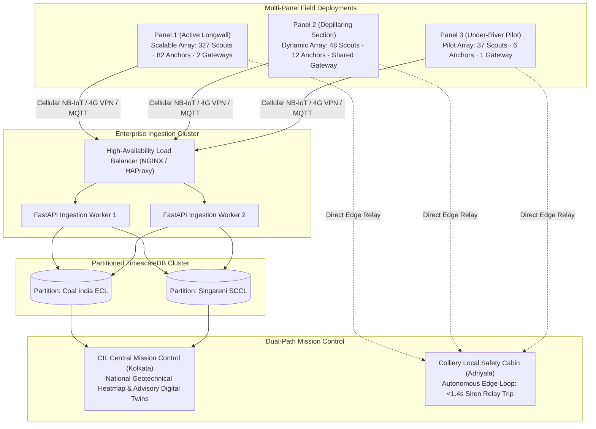

# Horizontal Scalability & Enterprise Architecture

**Module 09 — Deployment & Impact**  
**Cross-References:** [`installation-procedure.md`](installation-procedure.md) · [`cost-benefit-analysis.md`](cost-benefit-analysis.md) · [Module 03 Mesh Networking](../03-mesh-networking/tdma-scheduling.md)

---

### Question: How does AEGIS scale horizontally from a localized pilot cluster to multi-panel coalfield districts and national enterprise deployments?

**Answer:** Rather than functioning as a standalone, isolated instrument, AEGIS is architected as an enterprise-grade cyber-physical IoT network. The identical firmware, wire serialization, and calibration pipelines deployed on a pilot sub-slice scale seamlessly across dozens of concurrent extraction faces:

Node density is never constrained by static hardware limits; it scales purely with panel geometry and overburden physics ($r = H / \tan\beta$). While a pilot trial covers a $600\text{ m} \times 200\text{ m}$ sub-slice with 37 Scouts, a full-scale $1.8\text{ km}$ longwall panel dynamically deploys over 400 nodes without requiring modifications to software architecture or database schemas.

---

### Question: What mathematical laws govern RF channel capacity as sensor counts expand, and how does AEGIS avoid ALOHA packet collisions?

**Answer:** Conventional uncoordinated wireless IoT networks (e.g., standard LoRaWAN or pure ALOHA) collapse once channel utilization exceeds 18.4%, causing massive packet loss during emergency events. AEGIS guarantees deterministic channel capacity through strict Time-Division Multiple Access (TDMA):

1. **Deterministic Superframe Scheduling:**
   Within each repeating 60-second superframe, every Scout node is allocated an exclusive $250\text{ ms}$ collision-free uplink time slot. An Anchor Relay acting as a cluster head coordinates up to 5 child Scouts, aggregating their payloads into a single $600\text{ ms}$ trunk transmission bundle.
2. **Channel Utilization Bounds:**
   Even at maximum cluster capacity (60 nodes per Master Gateway), total active RF transmission airtime per 60-second superframe is strictly bounded:
   $$\text{Channel Utilization} = \frac{\sum T_{\text{airtime}}}{60.0\text{ seconds}} = \frac{60 \times 0.0904\text{ s} + 12 \times 0.406\text{ s}}{60.0\text{ s}} \approx \mathbf{8.0\%}$$
   This 8.0% worst-case utilization remains far below the ALOHA collapse threshold, guaranteeing that the channel never chokes.
3. **Multi-Panel Gateway Amortization:**
   When adjacent longwall panels operate within an RF radius of $2.0\text{ km}$, a single Master Gateway equipped with an $8.5\text{ dBi}$ collinear omnidirectional antenna coordinates both panels by assigning orthogonal 125 kHz channels (Channels 1–4 for Panel 1, Channels 5–6 for Panel 2). This cuts capital expenditure by ₹18,500 across neighboring panels while completely isolating channel traffic.

---

### Question: How does the cloud persistence layer sustain continuous streaming from hundreds of nodes without database degradation?

**Answer:** High-frequency geotechnical telemetry generates millions of time-series records weekly across multiple collieries. AEGIS prevents database bottlenecking through horizontal database partitioning:

* **TimescaleDB Hypertables:** Telemetry tables are partitioned by two dimensions: discrete space (`colliery_id`, `panel_id`) and continuous time (24-hour chunks). Queries requesting recent data for safety evaluation hit only the active chunk in memory, sustaining sub-millisecond query execution regardless of total database size.
* **Bounded Edge Rolling Store (Test T30):** Master Gateways maintain an edge rolling buffer (`nodes.csv`) strictly bounded to 36 hours of telemetry ($N_{\text{nodes}} \times 36\text{ h} \times 60\text{ samples} \approx 8.0\text{ MB}$). Older telemetry is compressed into immutable, columnar Apache Parquet files and uploaded to cloud cold storage, ensuring edge flash memory never exhausts.
* **Asynchronous PINN Worker Pooling:** Computationally intensive C9 Physics-Informed Neural Network surface reconstructions run in isolated Docker containers on cloud GPU workers. They retrain every 6 hours using subsampled 30-minute time slices (Test T36), completely decoupling machine learning execution from real-time ingestion pipelines.

---

### Question: How does AEGIS maintain sub-second emergency response times at the colliery when scaling to national corporate networks?

**Answer:** If emergency siren triggers depended on cloud processing, internet backhaul latency (typically 200 ms to several seconds over rural 4G cellular links) or cloud outages would endanger underground miners.

AEGIS solves this via **strict edge-cloud decoupling**:
1. **Autonomous Colliery Edge Loop:**
   The C8 Safety Engine runs locally on the Master Gateway microcontroller/embedded Linux edge computer at the colliery substation. It ingests calibrated telemetry directly from the RF concentrator, executes Byzantine spatial quorum voting, and energizes the physical 125 dB siren relay in **$< 1.4\text{ seconds}$**, completely independent of Internet, cellular, or cloud connectivity.
2. **Asynchronous Corporate Cloud Uplink:**
   The Master Gateway simultaneously streams telemetry bundles via MQTT over cellular NB-IoT or satellite backhaul to the enterprise cloud. Corporate executives in Kolkata or Hyderabad receive live regional heatmaps, long-term trend analytics, and advisory 3D digital twin models without ever sitting inside the primary safety-critical trip loop.
