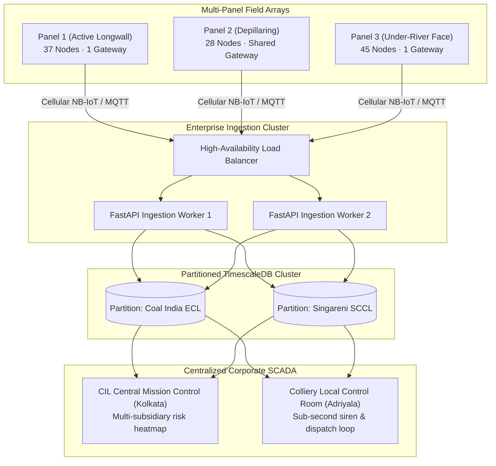

# Horizontal Scalability & Enterprise Architecture

**Module 09 — Deployment & Impact**  
**Cross-References:** [`installation-procedure.md`](installation-procedure.md) · [`cost-benefit-analysis.md`](cost-benefit-analysis.md) · [Module 03 Mesh Networking](../03-mesh-networking/tdma-scheduling.md)

---

## 1. Modular Scaling: From 1 Panel to 50 Panels

The AEGIS architecture is inherently modular. The identical software, firmware, and sensor hardware deployed on a single pilot panel scales horizontally to encompass an entire multi-panel coalfield or multiple regional mining subsidiaries.

---

## 2. RF Capacity & Gateway Sizing Rules

A common concern in wireless sensor networks is channel saturation as sensor counts grow. AEGIS manages RF capacity through deterministic allocation:

1. **Per-Gateway Node Ceiling:**
   * Under the 60-second superframe with 250 ms leaf slots, a single Master Gateway accommodates up to **60 active Scout nodes** while maintaining channel utilization below **8.0%** (well below the 18% ALOHA collapse threshold).
2. **Multi-Panel Gateway Amortization:**
   * When adjacent mining panels are situated within a $2\text{ km}$ radius, a single central Master Gateway with an 8.5 dBi omnidirectional antenna coordinates both panels on alternating frequency channels (Channels 1–4 vs. Channels 5–6), cutting per-panel capital costs by an additional ₹8,500.

---

## 3. Cloud Backend Horizontal Partitioning

At the enterprise level, the cloud backend scales horizontally using containerized microservices:
* **Database Partitioning:** TimescaleDB hypertables are partitioned by `colliery_id` and `panel_id`, ensuring sub-millisecond query performance even when ingesting millions of telemetry rows daily across 50 active coalfields.
* **Per-Panel PINN Worker Pool:** C9 surface reconstruction models run as asynchronous background workers in Docker containers, spinning up on GPU compute instances only during scheduled 6-hour retraining windows.
* **Headquarters Multi-Mine Dashboard:** Corporate leadership in Kolkata or Hyderabad can view a unified national map showing real-time geotechnical safety indices across all operational underground assets.
